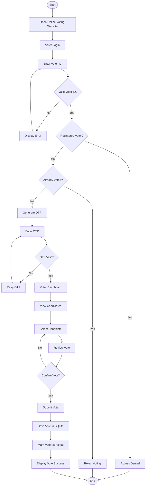
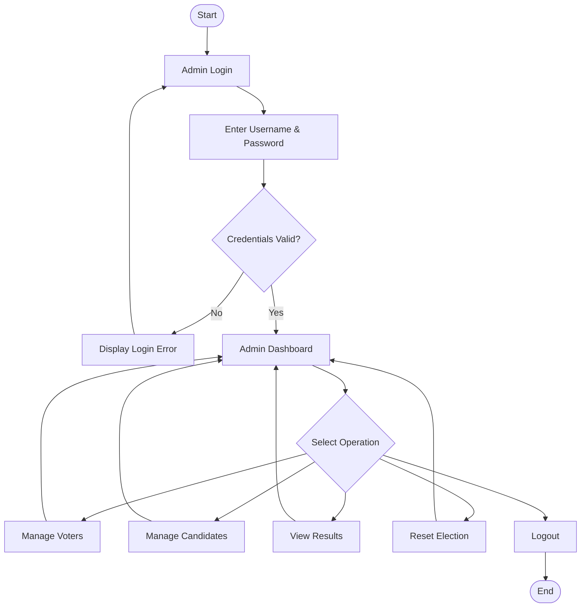
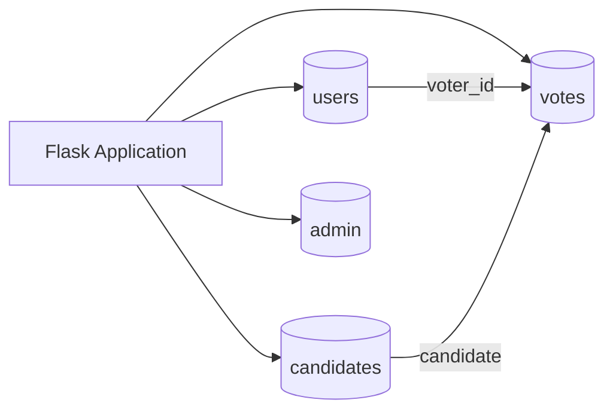

# 🗳️ Online Voting System

<p align="center">

A modern, responsive and secure **web-based voting application** built with Python, Flask, HTML, CSS, JavaScript and SQLite.

<br>

<a href="https://online-voting-system-3hx9.onrender.com/">
  
</a>

</p>

<p align="center">


</p>

---

## 🌐 Live Demo

<p align="center">

<a href="https://online-voting-system-3hx9.onrender.com/">
  
</a>

</p>

**Live URL:**
https://online-voting-system-3hx9.onrender.com/

> ⚠️ This application is developed for educational and academic demonstration purposes and is not intended for real-world public elections.

---

# 📌 About The Project

The **Online Voting System** is a web-based application that demonstrates how a basic electronic voting process can be implemented using a frontend, backend API and database.

The system provides separate interfaces for **voters** and **administrators**.

Voters can:

* Verify their Voter ID
* Complete OTP verification
* View candidates
* Select a candidate
* Review their vote
* Submit their vote
* Receive a vote confirmation

Administrators can:

* Login to the admin dashboard
* Manage registered voters
* Manage candidates
* View election statistics
* View election results
* Reset the election

The project is designed specifically as a **1st-Year CSE academic project**.

---

# 🎯 Project Objectives

* Develop a simple online voting application.
* Understand frontend and backend integration.
* Implement voter authentication.
* Implement OTP-based verification.
* Store voting information using SQLite.
* Prevent duplicate voting.
* Provide an administrator dashboard.
* Display election results automatically.
* Learn REST API development.
* Deploy a Python web application online.

---

# ✨ Features

## 👤 Voter

| Feature                 | Description                           |
| ----------------------- | ------------------------------------- |
| 🔐 Voter Login          | Validates registered Voter ID         |
| 🔢 OTP Verification     | Uses a simulated 4-digit OTP          |
| ⏱️ OTP Timer            | OTP expires after a limited time      |
| 👥 Candidate List       | Displays available candidates         |
| 🗳️ Vote Selection      | Allows selection of one candidate     |
| ✅ Vote Confirmation     | Shows confirmation before submission  |
| 🚫 Duplicate Protection | Prevents a voter from voting twice    |
| 🧾 Vote Receipt         | Displays successful vote confirmation |

## 👨‍💼 Administrator

| Feature                    | Description                                  |
| -------------------------- | -------------------------------------------- |
| 🔑 Admin Login             | Secure administrator authentication          |
| 📊 Dashboard               | Displays election statistics                 |
| 👥 Voter Management        | Add, search and remove voters                |
| 🧑‍💼 Candidate Management | Add and manage candidates                    |
| 📈 Results                 | View candidate vote counts and percentages   |
| 🔄 Election Reset          | Reset the election for another academic test |

---

# 🖥️ Screenshots

> Add your actual screenshots to the `docs/screenshots/` folder and update the filenames below.

## 🏠 Home Page

<p align="center">
  
</p>

## 🔐 Voter Login

<p align="center">
  
</p>

## 🔢 OTP Verification

<p align="center">
  
</p>

## 🗳️ Candidate Selection

<p align="center">
  
</p>

## 👨‍💼 Admin Dashboard

<p align="center">
  
</p>

## 📊 Election Results

<p align="center">
  
</p>

---

# 🏗️ System Architecture

```text
┌─────────────────────────────┐
│          USER               │
│      Web Browser            │
└──────────────┬──────────────┘
               │
               ▼
┌─────────────────────────────┐
│       FRONTEND              │
│ HTML5 + CSS3 + Bootstrap 5  │
│      JavaScript             │
└──────────────┬──────────────┘
               │
          HTTP / JSON
               │
               ▼
┌─────────────────────────────┐
│       FLASK BACKEND         │
│           app.py            │
│        REST APIs             │
└──────────────┬──────────────┘
               │
               ▼
┌─────────────────────────────┐
│       PYTHON LOGIC          │
│ auth.py                     │
│ voting.py                   │
│ otp.py                      │
│ security.py                 │
│ database.py                 │
└──────────────┬──────────────┘
               │
               ▼
┌─────────────────────────────┐
│       SQLITE DATABASE       │
│        voting.db            │
└─────────────────────────────┘
```

---

# 🔄 Voting Flowchart



---

# 👨‍💼 Admin Flowchart



---

# 🗄️ Database Flow



### Database Tables

### `users`

```text
voter_id
has_voted
registered_at
```

### `candidates`

```text
id
name
votes
```

### `votes`

```text
id
voter_id
candidate_name
voted_at
```

### `admin`

```text
id
username
password_hash
```

---

# 📁 Project Structure

```text
Online_Voting_System/
│
├── app.py
├── main.py
├── auth.py
├── voting.py
├── admin.py
├── otp.py
├── database.py
├── security.py
│
├── templates/
│   ├── base.html
│   ├── index.html
│   ├── about.html
│   ├── login.html
│   ├── otp.html
│   ├── voter_dashboard.html
│   ├── candidates.html
│   ├── vote_confirmation.html
│   ├── vote_success.html
│   ├── admin_login.html
│   ├── admin_dashboard.html
│   ├── manage_voters.html
│   ├── manage_candidates.html
│   └── results.html
│
├── static/
│   ├── css/
│   │   └── style.css
│   └── js/
│       └── main.js
│
├── data/
│   └── voting.db
│
├── docs/
│   ├── online_voting_flowchart.png
│   └── screenshots/
│       ├── home.png
│       ├── voter-login.png
│       ├── otp.png
│       ├── candidates.png
│       ├── admin-dashboard.png
│       └── results.png
│
├── tests/
│   ├── test_voting.py
│   └── test_web_api.py
│
├── requirements.txt
├── .gitignore
└── README.md
```

---

# 🛠️ Tech Stack

| Technology     | Purpose                    |
| -------------- | -------------------------- |
| 🐍 Python      | Backend programming        |
| 🌐 Flask       | Web framework and REST API |
| HTML5          | Web structure              |
| CSS3           | Website styling            |
| Bootstrap 5    | Responsive design          |
| JavaScript ES6 | Frontend functionality     |
| 🗄️ SQLite     | Database                   |
| 🔐 SHA-256     | Password hashing           |
| 🧪 Unittest    | Automated testing          |
| ☁️ Render      | Cloud deployment           |

---

# 🔌 REST API

| Method   | Endpoint                       | Description                    |
| -------- | ------------------------------ | ------------------------------ |
| `POST`   | `/api/voter/login`             | Voter login and OTP generation |
| `POST`   | `/api/voter/verify-otp`        | Verify OTP                     |
| `GET`    | `/api/voter/status`            | Get voter status               |
| `GET`    | `/api/candidates`              | Get candidate list             |
| `POST`   | `/api/vote`                    | Submit vote                    |
| `POST`   | `/api/admin/login`             | Admin authentication           |
| `GET`    | `/api/admin/stats`             | Election statistics            |
| `GET`    | `/api/admin/voters`            | Get registered voters          |
| `POST`   | `/api/admin/voters`            | Add voter                      |
| `DELETE` | `/api/admin/voters/<id>`       | Delete voter                   |
| `GET`    | `/api/admin/candidates`        | Get candidates                 |
| `POST`   | `/api/admin/candidates`        | Add candidate                  |
| `DELETE` | `/api/admin/candidates/<name>` | Delete candidate               |
| `GET`    | `/api/admin/results`           | Get election results           |
| `POST`   | `/api/admin/reset-election`    | Reset election                 |

---

# 🔐 Security

The application implements several basic security mechanisms:

### Voter ID Validation

The system validates the Voter ID format:

```text
AA001
AB123
XY999
```

### OTP Verification

* 4-digit OTP
* 120-second validity
* Limited verification attempts
* Simulated for educational purposes

### Password Hashing

Administrator passwords are stored as SHA-256 hashes rather than plain text.

### SQL Injection Protection

Database queries use parameterized SQL queries.

### Duplicate Vote Prevention

The application uses multiple checks to prevent duplicate voting:

```text
Voter Status Check
       +
Server-Side Validation
       +
Database UNIQUE Constraint
       +
Atomic Transaction
```

---

# 🚀 Installation

## 1. Clone Repository

```bash
git clone <YOUR-GITHUB-REPOSITORY-URL>
cd Online_Voting_System
```

## 2. Install Dependencies

```bash
pip install -r requirements.txt
```

## 3. Run Application

```bash
python app.py
```

## 4. Open Browser

```text
http://127.0.0.1:5000
```

---

# ☁️ Deployment

The project is deployed using **Render**.

### Build Command

```bash
pip install -r requirements.txt
```

### Start Command

```bash
gunicorn app:app
```

### Live Application

https://online-voting-system-3hx9.onrender.com/

> **Note:** SQLite is suitable for this academic project. A production application would require a persistent database and additional security infrastructure.

---

# 🔑 Demo Credentials

### Administrator

```text
Username: admin
Password: admin123
```

### Sample Voter IDs

```text
AA001
AA002
AA003
```

> These credentials are intended only for academic demonstration.

---

# 🧪 Testing

Run the automated tests with:

```bash
python -m unittest discover tests -v
```

The tests cover:

* Voter validation
* Database operations
* Vote submission
* Duplicate vote prevention
* Election results
* Flask API functionality

---

# 📊 Main Application Workflow

```text
                    ONLINE VOTING SYSTEM
                            │
              ┌─────────────┴─────────────┐
              │                           │
              ▼                           ▼
          👤 VOTER                    👨‍💼 ADMIN
              │                           │
              ▼                           ▼
         Voter Login                  Admin Login
              │                           │
              ▼                           ▼
       Voter ID Check              Admin Dashboard
              │                           │
              ▼                  ┌────────┼────────┐
        OTP Verification         │        │        │
              │                  ▼        ▼        ▼
              ▼               Voters Candidates Results
       Candidate List
              │
              ▼
       Select Candidate
              │
              ▼
         Review Vote
              │
              ▼
         Confirm Vote
              │
              ▼
        Save to Database
              │
              ▼
       Vote Confirmation
```

---

# ⚠️ Limitations

This project is designed for **academic demonstration**.

Current limitations include:

* OTP is simulated rather than sent through SMS/email.
* SQLite is used as the database.
* The application is designed for small academic elections.
* It is not designed for legally binding public elections.
* Cloud deployment with SQLite should not be treated as permanent election storage.

---

# 🔮 Future Improvements

Possible future improvements include:

* 📱 SMS OTP integration
* 📧 Email OTP integration
* 🗄️ PostgreSQL/MySQL database
* 🗳️ Multiple election support
* ⏰ Election scheduling
* 📄 PDF result generation
* 📊 Advanced election analytics
* 👥 Role-based administration
* 🔐 Improved authentication
* ☁️ Persistent cloud database
* ♿ Improved accessibility

---

# 🎓 Academic Information

**Project:** Online Voting System

**Course:** Computer Science & Engineering

**Project Level:** 1st-Year Academic Project

**Purpose:** Educational demonstration of web development, backend programming, databases, authentication, APIs, testing and deployment.

---

# 📜 Disclaimer

This software is developed strictly for **educational demonstration and academic project evaluation**.

It must not be used for real governmental, public or legally binding elections.

---

# ⭐ Acknowledgement

This project was developed as a learning project to understand how a complete web application can combine:

```text
Frontend
   ↓
Backend
   ↓
REST API
   ↓
Database
   ↓
Authentication
   ↓
Testing
   ↓
Cloud Deployment
```

---

<p align="center">

### 🗳️ Online Voting System

**Built for learning • Built with Python • Deployed on Render**

<br>

<a href="https://online-voting-system-3hx9.onrender.com/">
  
</a>

</p>
