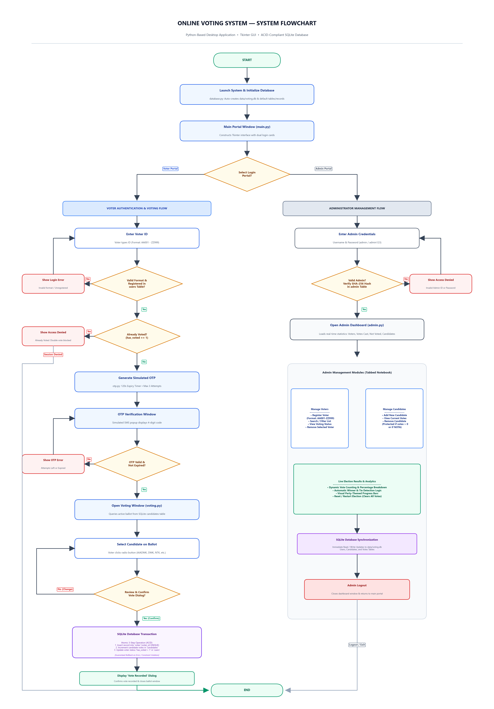
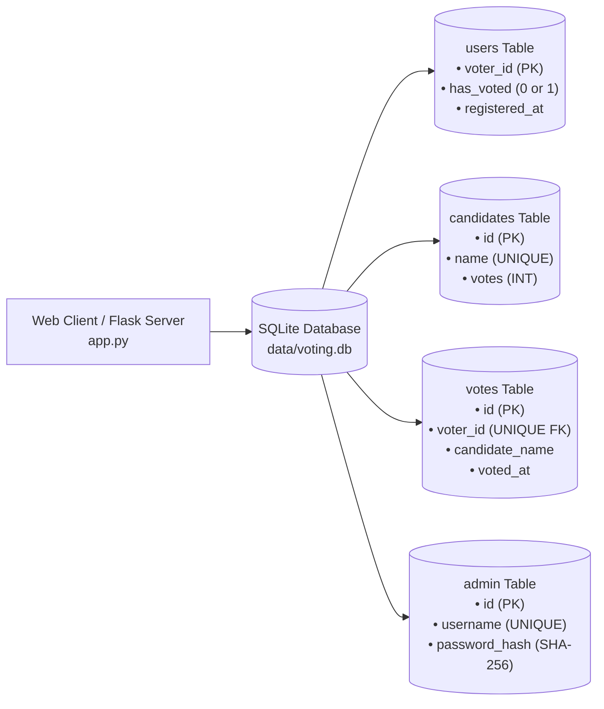

# Online Voting System 🗳️

A modern, responsive, and secure web-based electronic voting system built with an **HTML5/CSS3/JavaScript frontend**, a **Flask REST API layer**, and backed by an **ACID-compliant SQLite database**.

Designed and structured specifically as an exemplary **1st-Year Computer Science & Engineering (CSE) Academic Project**.

---

## 📌 Project Overview

Traditional paper-based or spreadsheet-based voting systems suffer from manual counting errors, vulnerability to tampering, lack of access control, and duplicate voting submissions. The **Online Voting System** resolves these challenges through a modern web application architecture:

```text
Browser Client (Desktop, Tablet, Mobile)
       ↓
HTML5 + CSS3 + Bootstrap 5 + Vanilla JavaScript (fetch API)
       ↓ HTTP / JSON API
Flask Web Application Server (`app.py`)
       ↓ Direct Function Calls
Core Python Logic (`database.py`, `security.py`, `otp.py`)
       ↓ Parameterized Queries & Atomic Transactions
SQLite Database (`data/voting.db`)
```

The application implements a two-stage voter verification process (Voter ID format check followed by simulated time-limited OTP), strict multi-layer double-voting prevention, SHA-256 hashed administrator authentication, and real-time live election analytics with visual progress bars and automatic tie detection.

---

## ✨ Key Features

### 👤 Voter Experience
* **Responsive Modern Web Interface:** Clean, accessible, mobile-friendly interface built with Bootstrap 5 and custom slate/blue styling.
* **Format-Enforced Voter Authentication:** Strict validation for Voter IDs adhering to the standard format `AA001` through `ZZ999`.
* **Simulated Two-Factor OTP:** 4-digit numeric One-Time Password with a live 120-second countdown timer and a maximum 3-attempt limit.
* **Dynamic Ballot Display:** Automatically retrieves the registered candidate list directly from the database with visual party branding accents.
* **Review & Confirmation Modal:** Prompts voters to review their selection before final submission to eliminate accidental votes.
* **Guaranteed One-Vote-Per-Voter:** Multi-layer prevention of duplicate voting at both the client UI and SQLite database transaction levels.
* **Instant Digital Receipt:** Clear confirmation screen displaying transaction status and participant acknowledgement.

### 👨‍💼 Administrator Portal
* **Cryptographic Admin Login:** Admin passwords are encrypted using SHA-256 hashes; plain-text credentials are never stored.
* **Live Overview Statistics:** Real-time metrics tracking Registered Voters, Total Votes Cast, Pending Voters, and Active Candidates.
* **Voter Management:** Register new voters with duplicate checks, live real-time search/filter by ID, and remove voters.
* **Candidate Management:** Add new candidates/parties dynamically, monitor candidate vote tallies, and remove candidates with 0 votes (with NOTA protected from deletion).
* **Live Results & Analytics:** Automatic vote percentage calculations, dynamic progress bars, leading candidate or tie detection, and safe election reset/restart functionality.

---

## 🔄 System Flowchart

The following flowchart shows the main workflow of the Online Voting System:



### Flowchart Explanation

1. **System Initialization:** Upon execution of `app.py`, the system verifies that `data/voting.db` exists. If not, it creates the database and initializes four tables: `users`, `candidates`, `votes`, and `admin`, seeding default candidate choices and the administrator credentials.
2. **Dual Portals:** The main navigation presents distinct portals for Voters and Administrators.
3. **Voter Verification Pipeline:**
   - **Step 1 (Format Check):** Voter ID must match the regular expression `^[A-Z]{2}[0-9]{3}$` (excluding `000`).
   - **Step 2 (Registration Check):** Queries the `users` table to ensure the voter is pre-registered.
   - **Step 3 (Status Check):** Inspects `has_voted`. If `1`, login is rejected immediately.
   - **Step 4 (OTP Verification):** Generates a random 4-digit OTP valid for 120 seconds with up to 3 attempts.
4. **Ballot Casting & Double-Voting Safeguard:**
   - The voter selects a candidate and confirms their choice via a review dialog modal.
   - The "Confirm Vote" button is immediately disabled to eliminate double-click race conditions.
   - An **atomic SQLite transaction** records the ballot in `votes`, increments `candidates.votes`, and updates `users.has_voted = 1`. If any constraint fails, the entire transaction rolls back.
5. **Admin Operations:**
   - Verifies username and SHA-256 password hash against the `admin` table.
   - Grants access to a dashboard for voter management, candidate management, real-time results with leader/tie calculations, and election resets.

---

## 👤 Voter Workflow

The voter journey follows ten structured steps:

1. **Open the Website:** Navigate to `http://127.0.0.1:5000` in your web browser.
2. **Click Voter Login:** Navigate to the Voter Login page (`/login`).
3. **Enter Voter ID:** Type your registered Voter ID (e.g., `AA001`) into the input box.
4. **Format & Eligibility Validation:** The system verifies the format is 2 uppercase letters followed by 3 digits and checks `voting.db` to ensure registration and verify the voter has not already voted.
5. **Receive Simulated OTP:** An educational pop-up banner displays the 4-digit OTP (valid for 120 seconds).
6. **Enter & Verify OTP:** Enter the OTP code on the verification screen (`/otp`) before the countdown timer expires (maximum 3 attempts).
7. **Access Voter Dashboard:** View your active status and click "Proceed to Candidate Ballot".
8. **Select Candidate:** View registered candidates with distinctive party accents and select your choice.
9. **Review & Confirm Choice:** Click "Review & Confirm Vote" to inspect the confirmation modal displaying your Voter ID and chosen candidate.
10. **Atomic Submission & Success Receipt:** The database atomically writes the vote, increments candidate counter, and marks the voter status as "Voted". A success receipt is shown.

---

## 👨‍💼 Admin Workflow

The election administrator journey follows six structured steps:

1. **Admin Login:** Navigate to `/admin/login` and enter admin username (`admin`) and password (`admin123`).
2. **Dashboard Overview:** The system validates the SHA-256 hash and loads the dashboard with live metric cards: Registered Voters, Votes Cast, Pending Voters, and Total Candidates.
3. **Manage Voters (`/admin/voters`):**
   - Register new voter IDs (validated format `AA001` - `ZZ999`).
   - Use the live search bar to filter voters by ID.
   - Inspect voting status ("Voted" vs "Pending").
   - Delete voters if needed.
4. **Manage Candidates (`/admin/candidates`):**
   - Register new candidates or political parties (2-30 alphanumeric characters).
   - Inspect individual vote tallies.
   - Delete candidates who have 0 votes (NOTA and candidates with votes are protected).
5. **Live Results & Analytics (`/admin/results`):**
   - View dynamic leader banner (displays clear leader, highlights ties between top candidates, or indicates no votes yet).
   - Inspect vote counts, percentages, and visual color distribution bars.
   - Refresh results on-demand or execute "Reset / Restart Election" to clear votes for a new election cycle.
6. **Logout:** Click the Logout button in the navigation bar to safely terminate the administrator session.

---

## 🏗️ Project Structure

```text
Online_Voting_System/
│
├── app.py                      # Flask web application & REST API layer
├── main.py                     # Original desktop application (preserved & runnable)
├── auth.py                     # Voter authentication & OTP coordination
├── voting.py                   # Ballot selection & vote submission logic
├── admin.py                    # Admin credentials verification & desktop dashboard
├── otp.py                      # 4-digit OTP generation, 120s countdown & attempt limiter
├── database.py                 # SQLite schema, parameterized queries & ACID transactions
├── security.py                 # Voter ID regex validation & SHA-256 password hashing
│
├── templates/                  # Jinja2 HTML5 web templates
│   ├── base.html               # Base layout with navbar, footer, alerts & session indicator
│   ├── index.html              # Landing page with hero banner & 5-step workflow
│   ├── about.html              # Architecture explanation & 1st-year CSE viva Q&A
│   ├── login.html              # Voter authentication portal
│   ├── otp.html                # OTP verification with live countdown timer
│   ├── voter_dashboard.html    # Voter status & ballot access dashboard
│   ├── candidates.html         # Candidate selection ballot with review modal
│   ├── vote_confirmation.html  # Standalone review and confirmation template
│   ├── vote_success.html       # Vote recorded digital receipt
│   ├── admin_login.html        # Administrator login portal
│   ├── admin_dashboard.html    # Admin dashboard with summary metric cards
│   ├── manage_voters.html      # Voter management table with live search & add form
│   ├── manage_candidates.html  # Candidate management with vote tallies & NOTA safeguard
│   └── results.html            # Certified results with leader/tie banner & progress bars
│
├── static/
│   ├── css/
│   │   └── style.css           # Custom slate/blue design system matching desktop theme
│   └── js/
│       └── main.js             # Client-side JavaScript handling fetch() APIs, timer & modals
│
├── data/
│   └── voting.db               # SQLite database file (auto-created on launch)
│
├── docs/
│   └── online_voting_flowchart.png  # High-resolution system flowchart image
│
├── tests/
│   ├── test_voting.py          # Existing unit test suite (13 core logic tests)
│   └── test_web_api.py         # Web API integration test suite (8 web tests)
│
├── requirements.txt            # Python dependencies (Flask)
├── .gitignore                  # Git ignore rules
└── README.md                   # Comprehensive documentation
```

---

## 🛠️ Technologies Used

| Technology | Role in Project | Why Chosen |
|---|---|---|
| **HTML5 & CSS3** | Web Presentation | Semantic markup, responsive layout, accessible UI |
| **Bootstrap 5** | Responsive Framework | Professional grid system, buttons, cards, modals |
| **Vanilla JavaScript (ES6)** | Client-Side Interactivity | Asynchronous `fetch()` calls, live OTP countdown timer, search filtering |
| **Python 3.8+** | Backend Language | Clean syntax, standard library rich, robust |
| **Flask** | Web Application Server | Lightweight, zero unnecessary overhead, student-friendly API routing |
| **SQLite3** | Relational Database Storage | Serverless, file-based, supports foreign keys and ACID transactions |
| **Hashlib** | Cryptography / Security | Standard Python library providing SHA-256 hashing for admin passwords |
| **Unittest** | Test-Driven Verification | Automated unit and integration testing verifying logic and APIs |

---

## 🔌 REST API Endpoints

The Flask server exposes clean REST API endpoints communicating via JSON:

| Method | Endpoint | Description | Access |
|---|---|---|---|
| `POST` | `/api/voter/login` | Validates Voter ID format, registration, and status; generates OTP | Public |
| `POST` | `/api/voter/verify-otp` | Validates 4-digit OTP code, expiration, and attempt limits | Pending Voter |
| `GET` | `/api/voter/status` | Returns registration and voting status for active voter | Voter |
| `GET` | `/api/candidates` | Returns list of registered ballot candidates | Voter / Public |
| `POST` | `/api/vote` | Atomically commits vote using SQLite transaction | Authenticated Voter |
| `POST` | `/api/admin/login` | Authenticates administrator via SHA-256 password hash | Public |
| `GET` | `/api/admin/stats` | Returns real-time election summary metrics | Admin Only |
| `GET` | `/api/admin/voters` | Lists all registered voters with voting status | Admin Only |
| `POST` | `/api/admin/voters` | Registers a new voter in `users` table | Admin Only |
| `DELETE` | `/api/admin/voters/<id>` | Deletes a voter from the database | Admin Only |
| `GET` | `/api/admin/candidates` | Lists all candidates with vote tallies | Admin Only |
| `POST` | `/api/admin/candidates` | Registers a new candidate in `candidates` table | Admin Only |
| `DELETE` | `/api/admin/candidates/<name>` | Deletes candidate (NOTA and voted candidates protected) | Admin Only |
| `GET` | `/api/admin/results` | Computes certified vote totals, percentages, and leader/tie | Admin Only |
| `POST` | `/api/admin/reset-election` | Clears all cast votes and resets voter statuses | Admin Only |

---

## 💾 Database Schema & Data Flow

### Database Architecture Diagram



### Table Definitions

1. **`users` Table:**
   ```sql
   CREATE TABLE users (
       voter_id TEXT PRIMARY KEY,
       has_voted INTEGER NOT NULL DEFAULT 0,
       registered_at TIMESTAMP DEFAULT CURRENT_TIMESTAMP
   );
   ```
2. **`candidates` Table:**
   ```sql
   CREATE TABLE candidates (
       id INTEGER PRIMARY KEY AUTOINCREMENT,
       name TEXT UNIQUE NOT NULL,
       votes INTEGER NOT NULL DEFAULT 0
   );
   ```
3. **`votes` Table (Audit Trail & Double-Voting Barrier):**
   ```sql
   CREATE TABLE votes (
       id INTEGER PRIMARY KEY AUTOINCREMENT,
       voter_id TEXT UNIQUE NOT NULL,
       candidate_name TEXT NOT NULL,
       voted_at TIMESTAMP DEFAULT CURRENT_TIMESTAMP,
       FOREIGN KEY (voter_id) REFERENCES users(voter_id) ON DELETE CASCADE
   );
   ```
4. **`admin` Table (Hashed Authentication):**
   ```sql
   CREATE TABLE admin (
       id INTEGER PRIMARY KEY AUTOINCREMENT,
       username TEXT UNIQUE NOT NULL,
       password_hash TEXT NOT NULL
   );
   ```

---

## 🔐 Security Features

1. **Voter ID Regular Expression Validation:** Rejects any input that does not match 2 letters followed by 3 digits (e.g. rejects `12345`, `AA000`, `abc`, or empty strings).
2. **SHA-256 Cryptographic Password Hashing:** Admin passwords are never stored in plaintext. Entering credentials generates a hash that is compared against the stored hash in the database.
3. **Simulated Time-Limited OTP:** Generates a cryptographically randomized 4-digit code that expires after 120 seconds and locks out after 3 incorrect attempts.
4. **SQL Injection Prevention:** Every database query in `database.py` uses parameterized queries (`?` placeholders) instead of string formatting, fully preventing SQL injection attacks.
5. **Two-Level Double-Voting Prevention:**
   - *Application Layer:* The submit button is disabled on click to prevent rapid double-clicks, and server-side checks reject already-voted voters.
   - *Database Layer:* The `votes` table enforces a `UNIQUE` constraint on `voter_id`, and `users.has_voted` is verified inside the atomic transaction.

---

## 🚀 Installation & How to Run

### Prerequisites
* Python 3.8 or higher installed.
* Install requirements:
  ```bash
  pip install -r requirements.txt
  ```

### Run Web Application (Locally)
```bash
python app.py
```
Open your browser and visit:
```text
http://127.0.0.1:5000
```

### 🌐 Deploy to Render (Free Web Service)

1. Push your repository to GitHub.
2. In the [Render Dashboard](https://dashboard.render.com/), click **New +** → **Web Service**.
3. Connect your GitHub repository.
4. Configure service settings:
   * **Name:** `online-voting-system` (or your choice)
   * **Environment:** `Python`
   * **Region:** (Nearest to you)
   * **Branch:** `main`
   * **Build Command:** `pip install -r requirements.txt`
   * **Start Command:** `gunicorn app:app`
   * **Instance Type:** `Free`
5. *(Optional)* Under **Environment Variables**, add:
   * `FLASK_SECRET_KEY`: A strong random string for signing session cookies.
6. Click **Deploy Web Service**.

> [!NOTE]
> **SQLite on Render Free Tier:** Render Free Web Services use an ephemeral filesystem. Any changes written to `data/voting.db` (such as newly cast votes or added voters) persist while the container is running, but will reset to the Git repository baseline if the free instance spins down due to inactivity or when a new deployment is triggered. For production multi-instance persistence, a managed PostgreSQL database can be connected in the future.

### (Optional) Run Desktop GUI (Original Tkinter Version)
```bash
python main.py
```


---

## 🔑 Default Credentials

### Administrator Login
* **Username:** `admin`
* **Password:** `admin123`
*(Stored in SQLite as an irreversible SHA-256 hash).*

### Sample Voter IDs Pre-Configured
* **Eligible (Has Not Voted):** `AA001`
* **Voted (Already Cast):** `AA002`, `AA003`
*(Additional voters can be registered directly from the Admin Dashboard).*

---

## 🧪 Testing & Verification

The project includes an automated test suite containing **21 unit & integration tests** covering validation, database transactions, double-voting prevention, tie detection, and all Flask web API endpoints:

```bash
python -m unittest discover tests -v
```

All 21 tests execute and pass in under 1 second.

---

## ⚠️ Project Limitations & Future Improvements

### Current Design Decisions (1st-Year CSE Scope)
* **Simulated OTP:** For offline evaluation, OTPs are displayed via educational banners on-screen rather than requiring paid SMS third-party APIs (like Twilio).
* **Single Server SQLite:** Uses local SQLite, ideal for zero-configuration academic evaluation without requiring external database servers.

### Future Improvements
* Integration with live SMS/email gateways for real-world OTP transmission.
* Multi-election support allowing concurrent department elections.
* Export election audit reports to PDF format.

---

## 📜 Academic Disclaimer

This software is developed strictly for educational demonstration and academic project evaluation as part of the 1st-Year B.Tech / B.E. Computer Science and Engineering (CSE) curriculum.
